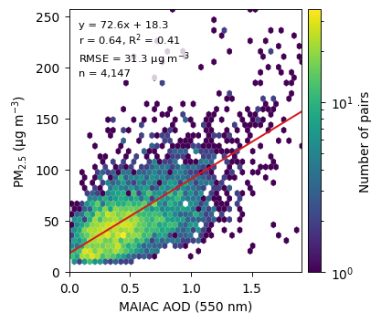
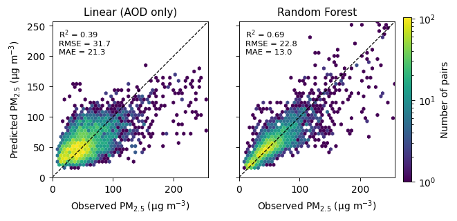
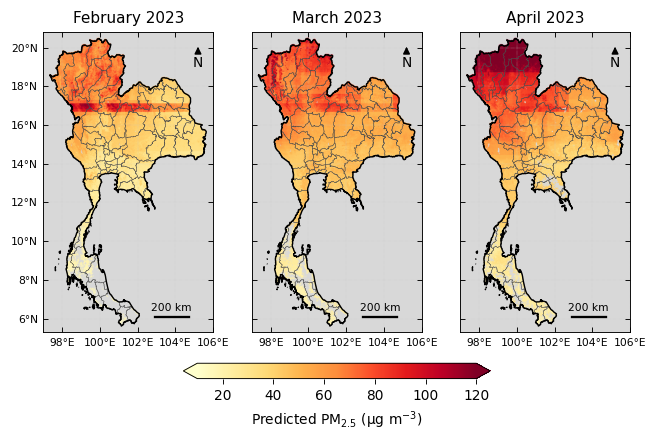
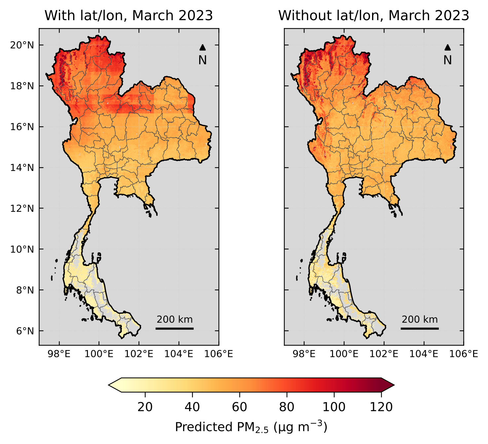

# Teach_AOD_PM_PCD

## เรียนรู้ความสัมพันธ์ระหว่าง AOD จากดาวเทียมกับ PM2.5 ภาคพื้นดินของประเทศไทย

**MODIS MAIAC AOD (MCD19A2) · PM2.5 กรมควบคุมมลพิษ · Regression · Random Forest · แผนที่ 77 จังหวัด**

[](https://github.com/nattaponm/Teach_AOD_PM_PCD)
[](https://colab.research.google.com/github/nattaponm/Teach_AOD_PM_PCD/blob/main/01_AOD_and_PM25_Basics.ipynb)
[](https://developers.google.com/earth-engine/datasets/catalog/MODIS_061_MCD19A2_GRANULES)
[](https://www.python.org/)

---

## เกี่ยวกับ repository นี้

ชุดบทเรียนนี้จัดทำสำหรับนิสิตวิทยาศาสตร์สิ่งแวดล้อม **ระดับปริญญาตรีปี 3–4 และปริญญาโท**
ใช้ **Google Colab** เป็นเครื่องมือหลัก ทุก Notebook เปิดและรันได้จากปุ่ม *Open in Colab* โดยไม่ต้องติดตั้งโปรแกรม

คำถามหลักของทั้งชุดคือ

> **เราใช้ค่า AOD ที่ดาวเทียมวัดได้ บอกค่า PM2.5 ที่ระดับพื้นดินได้ดีแค่ไหน**

ประเทศไทยมีสถานีตรวจวัดคุณภาพอากาศราวร้อยแห่ง แต่มีพื้นที่กว่า 5 แสนตารางกิโลเมตร
ดาวเทียมมองเห็นได้ทั้งประเทศ แต่วัดฝุ่นทางอ้อมและมองไม่ทะลุเมฆ
นิสิตจะได้ลงมือกับข้อมูลจริงเพื่อดูว่าสองแหล่งข้อมูลนี้เสริมกันได้อย่างไร และมีข้อจำกัดอะไร

**ช่วงเวลาที่ศึกษา: กุมภาพันธ์–เมษายน 2023**
- ปี 2023 เป็นปีที่ฝุ่นรุนแรงที่สุดในข้อมูล PCD ปี 2021–2025 (ค่าเฉลี่ยทุกสถานีช่วง ก.พ.–เม.ย. 48 µg/m³ เทียบกับ 28–38 µg/m³ ในปีอื่น)
- ก.พ.–เม.ย. เป็นช่วงฝุ่นสูงของภาคเหนือและเมฆน้อย ดาวเทียมจึงวัด AOD ได้บ่อย
- บริบท: กรมควบคุมมลพิษระบุว่าฝุ่นช่วงต้นปีมาจากการสะสมในพื้นที่ สภาพอากาศปิด และหมอกควันข้ามแดน ก่อนคลี่คลายเมื่อเข้าฤดูฝน ([Thai PBS, 19 พ.ค. 2569](https://www.thaipbs.or.th/news/content/506117))

หลักการของชุดบทเรียน

> **หนึ่ง cell หนึ่งแนวคิด** · **โค้ดอ่านง่ายสำคัญกว่าโค้ดสั้น** · **ตีความผลได้สำคัญกว่ารันผ่าน**

---

## เส้นทางการเรียนรู้

```
00 เตรียมข้อมูล (ผู้สอน)
        ↓
01 AOD และ PM2.5 คืออะไร
        ↓
02 จับคู่ข้อมูลอย่างไร ข้อมูลหายเท่าใด
        ↓
03 สัมพันธ์กันแค่ไหน (correlation, regression)
        ↓
04 Machine learning ช่วยได้เท่าใด (Random Forest)
        ↓
05 ทำแผนที่ได้หรือไม่ เชื่อได้แค่ไหน
```

| ไฟล์ | คำถามหลัก | เวลา | GitHub | Colab |
|---|---|---|---|---|
| 00 | ได้ข้อมูลมาอย่างไร (สำหรับผู้สอน) | — | [เปิดดู](https://github.com/nattaponm/Teach_AOD_PM_PCD/blob/main/00_Data_Preparation_AOD_PM25.ipynb) | [](https://colab.research.google.com/github/nattaponm/Teach_AOD_PM_PCD/blob/main/00_Data_Preparation_AOD_PM25.ipynb) |
| 01 | AOD และ PM2.5 วัดอะไร ต่างกันอย่างไร | 90 นาที | [เปิดดู](https://github.com/nattaponm/Teach_AOD_PM_PCD/blob/main/01_AOD_and_PM25_Basics.ipynb) | [](https://colab.research.google.com/github/nattaponm/Teach_AOD_PM_PCD/blob/main/01_AOD_and_PM25_Basics.ipynb) |
| 02 | ดาวเทียมเห็นกี่วัน ข้อมูลที่หายทำให้ผลเอนเอียงหรือไม่ | 90 นาที | [เปิดดู](https://github.com/nattaponm/Teach_AOD_PM_PCD/blob/main/02_Matching_and_Missing_Data.ipynb) | [](https://colab.research.google.com/github/nattaponm/Teach_AOD_PM_PCD/blob/main/02_Matching_and_Missing_Data.ipynb) |
| 03 | AOD อธิบาย PM2.5 ได้แค่ไหน | 100 นาที | [เปิดดู](https://github.com/nattaponm/Teach_AOD_PM_PCD/blob/main/03_Correlation_and_Regression.ipynb) | [](https://colab.research.google.com/github/nattaponm/Teach_AOD_PM_PCD/blob/main/03_Correlation_and_Regression.ipynb) |
| 04 | Random Forest ดีกว่าเส้นตรงเท่าใด | 110 นาที | [เปิดดู](https://github.com/nattaponm/Teach_AOD_PM_PCD/blob/main/04_Random_Forest_PM25.ipynb) | [](https://colab.research.google.com/github/nattaponm/Teach_AOD_PM_PCD/blob/main/04_Random_Forest_PM25.ipynb) |
| 05 | แผนที่ PM2.5 ทั้งประเทศเชื่อได้แค่ไหน | 110 นาที | [เปิดดู](https://github.com/nattaponm/Teach_AOD_PM_PCD/blob/main/05_PM25_Mapping_and_Limitations.ipynb) | [](https://colab.research.google.com/github/nattaponm/Teach_AOD_PM_PCD/blob/main/05_PM25_Mapping_and_Limitations.ipynb) |

Notebook 01–05 **รันได้อิสระจากกัน** และ **ไม่ต้องมีบัญชี Google Earth Engine** เพราะอ่านข้อมูลที่เตรียมไว้ในโฟลเดอร์ `data/` ของ repository นี้

---

## เริ่มต้นใช้งาน

**สำหรับนิสิต**
1. ลงชื่อเข้าใช้ Google account
2. กดปุ่ม *Open in Colab* ของ Notebook 01
3. อ่านคำอธิบาย → รันทีละ cell → ดูผล → ตอบคำถาม "ลองคิด" ในใจก่อนรัน cell ถัดไป
4. ทำแบบฝึกหัดท้ายไฟล์ด้วยตนเองก่อน แล้วจึงเปิดเฉลย

ไม่แนะนำให้กด *Run all* ในรอบแรก

**สำหรับผู้สอน (หรือผู้ที่ต้องการเปลี่ยนปี/ช่วงเวลา)**
1. ลงทะเบียน [Google Earth Engine](https://console.cloud.google.com/earth-engine) และสร้าง Google Cloud Project
2. เปิด Notebook 00 แก้ `PROJECT` เป็น Project ID ของตนเอง และแก้ `YEAR` หากต้องการปีอื่น
3. รันจนจบ แล้วนำไฟล์ในโฟลเดอร์ `data/` ขึ้น repository

---

## หลักการที่ควรรู้ก่อนเรียน

### 1. PM2.5 กับ AOD ไม่ใช่สิ่งเดียวกัน

| | PM2.5 | AOD |
|---|---|---|
| ชื่อเต็ม | Particulate Matter ≤ 2.5 µm | Aerosol Optical Depth (ความลึกเชิงแสงของละอองลอย) |
| วัดอะไร | **มวล** ของฝุ่นในอากาศ 1 ลูกบาศก์เมตร | ละอองลอย **ลดทอนแสง** ไปมากเท่าใด |
| วัดที่ไหน | ระดับพื้นดิน | **ตลอดทั้งคอลัมน์** จากพื้นดินถึงขอบบรรยากาศ |
| หน่วย | µg/m³ | ไม่มีหน่วย |
| เวลา | เฉลี่ย 24 ชั่วโมง | ขณะดาวเทียมผ่าน (ประมาณ 10:30 และ 13:30 น.) |
| ความครอบคลุม | เฉพาะจุดที่มีสถานี | ทั้งประเทศ ยกเว้นบริเวณที่มีเมฆ |

**กฎ Beer–Lambert** อธิบายว่า AOD คืออะไร

$$I = I_0 \, e^{-\tau/\mu}$$

- $I_0$ = ความเข้มแสงอาทิตย์ที่ขอบบรรยากาศ, $I$ = ความเข้มแสงที่เหลือถึงพื้นดิน
- $\tau$ = AOD, $\mu$ = cosine ของมุมที่ดวงอาทิตย์ทำกับแนวดิ่ง

อ่านแบบง่าย: แสงลดลงแบบ exponential ตามปริมาณละอองลอยที่ขวางทาง
เช่น $\tau = 0.5$ และดวงอาทิตย์อยู่เหนือศีรษะ แสงตรงเหลือ $e^{-0.5} \approx 61\%$

สองค่านี้มักไปด้วยกัน แต่ไม่เท่ากัน เพราะ
- **ควันลอยสูง** — AOD สูง แต่ PM2.5 ที่พื้นไม่สูง
- **ชั้นผสม (mixing layer) ตื้น** — ฝุ่นถูกกดไว้ใกล้พื้น PM2.5 สูงแม้ AOD ปานกลาง
- **ความชื้น** — อนุภาคดูดน้ำแล้วพองตัว กระเจิงแสงมากขึ้นโดยมวลแห้งเท่าเดิม

### 2. ข้อมูล AOD: ผลิตภัณฑ์ MAIAC `MCD19A2`

- มาจากเซนเซอร์ **MODIS** บนดาวเทียม Terra และ Aqua ประมวลผลด้วยอัลกอริทึม **MAIAC** (Multi-Angle Implementation of Atmospheric Correction)
- ความละเอียด **1 km** รายวัน ใน Google Earth Engine คือ `MODIS/061/MCD19A2_GRANULES`
- เก็บเป็น *granule* (หนึ่งภาพต่อหนึ่งรอบโคจร) วันหนึ่งจึงมีหลายภาพ ต้องรวมเป็นภาพรายวันเอง

ก่อนใช้งานต้องทำสองขั้นตอนกับทุกภาพ

**ปรับค่าด้วย scale factor**

$$\mathrm{AOD}_{550} = DN \times 0.001$$

**เก็บเฉพาะ pixel คุณภาพดีที่สุด** จากแบนด์ `AOD_QA` บิตที่ 8–11

$$\text{best} = \big[(QA \gg 8)\ \&\ 15\big] = 0$$

อ่านว่า เลื่อนบิตไปทางขวา 8 ตำแหน่ง เก็บ 4 บิตล่าง ถ้าได้ 0 คือ pixel ที่ไม่มีเมฆและไม่ติดขอบเมฆ

แบนด์ที่ใช้ในชุดบทเรียนนี้

| แบนด์ | ความหมาย | ใช้ทำอะไร |
|---|---|---|
| `Optical_Depth_055` | AOD ที่ความยาวคลื่น 550 nm | ตัวแปรหลัก |
| `Column_WV` | ไอน้ำในคอลัมน์บรรยากาศ (cm) | ตัวแปรเสริมแทนความชื้น |
| `AOD_QA` | รหัสคุณภาพ | กรอง pixel |

### 3. การจับคู่ข้อมูล (collocation)

- **เชิงพื้นที่** — ใช้ค่าเฉลี่ย AOD ในวงกลมรัศมี 1.5 km รอบสถานี เพราะค่าของ pixel เดียวมี noise สูง และเก็บจำนวน pixel ที่มีค่าไว้ใช้กรองคุณภาพ (ในข้อมูลชุดนี้มีได้สูงสุดราว 14 pixel ต่อสถานี เพราะนับทุก pixel ที่วงกลมแตะ)
- **เชิงเวลา** — จับคู่ด้วยวันที่เดียวกัน แม้ AOD เป็นค่าช่วงสายถึงบ่าย ส่วน PM2.5 เป็นค่าเฉลี่ยทั้งวัน

อัตราการได้ข้อมูล (data availability)

$$A = \frac{N_{\text{valid}}}{N_{\text{total}}} \times 100\%$$

ถ้าดาวเทียมมองไม่เห็นเฉพาะวันบางประเภท (เช่น วันฝนตกที่อากาศสะอาด) ค่าเฉลี่ยจาก "วันที่มี AOD" จะไม่ใช่ตัวแทนของทุกวัน เรียกว่า **sampling bias**

### 4. สหสัมพันธ์และการถดถอยเชิงเส้น

**Pearson correlation** วัดว่าสองตัวแปรไปด้วยกันเป็นเส้นตรงแค่ไหน

$$r = \frac{\sum (x_i - \bar{x})(y_i - \bar{y})}{\sqrt{\sum (x_i - \bar{x})^2}\ \sqrt{\sum (y_i - \bar{y})^2}}$$

**Linear regression** เขียนความสัมพันธ์เป็นสมการ

$$\widehat{PM_{2.5}} = \beta_0 + \beta_1 \cdot AOD$$

- $\beta_1$ (slope) = AOD เพิ่ม 1 หน่วย PM2.5 เพิ่มกี่ µg/m³
- $\beta_0$ (intercept) = PM2.5 ที่แบบจำลองคาดเมื่อ AOD = 0

### 5. ตัวชี้วัดความแม่นยำ

$$R^2 = 1 - \frac{\sum (y_i - \hat{y}_i)^2}{\sum (y_i - \bar{y})^2} \qquad RMSE = \sqrt{\frac{1}{n}\sum (y_i - \hat{y}_i)^2} \qquad MAE = \frac{1}{n}\sum |y_i - \hat{y}_i|$$

| ตัวชี้วัด | อ่านว่า | หน่วย |
|---|---|---|
| $R^2$ | สัดส่วนความแปรปรวนของ PM2.5 ที่แบบจำลองอธิบายได้ (ยิ่งใกล้ 1 ยิ่งดี) | ไม่มี |
| RMSE | ขนาดความคลาดเคลื่อน โดยให้น้ำหนักกับความผิดพลาดขนาดใหญ่มาก | µg/m³ |
| MAE | ขนาดความคลาดเคลื่อนเฉลี่ย | µg/m³ |

### 6. Machine learning: Random Forest

**Machine learning** คือการให้คอมพิวเตอร์เรียนรู้ความสัมพันธ์จากตัวอย่าง แทนการที่เรากำหนดรูปสมการเอง
ในงานนี้เป็น *supervised regression*: เรามีตัวแปรทำนาย (predictors) และคำตอบที่ถูก (PM2.5 จากสถานี) ให้แบบจำลองเรียนรู้

**Decision tree** ทำนายด้วยการถามคำถามใช่/ไม่ใช่ต่อกันเป็นทอด เช่น "AOD > 0.6 ไหม" → "ละติจูด > 17 ไหม" แล้วตอบเป็นค่าเฉลี่ยของตัวอย่างที่ตกอยู่ในกลุ่มเดียวกัน ต้นไม้ต้นเดียวมักจำข้อมูลฝึกได้ดีเกินไป (overfit)

**Random Forest** แก้ปัญหานี้ด้วยการสร้างต้นไม้จำนวนมากที่ต่างกันเล็กน้อย แล้วเฉลี่ยคำตอบ

```
ข้อมูลฝึก ──► สุ่มตัวอย่างซ้ำ (bootstrap) B ชุด
                 │
     ┌───────────┼───────────┐
   ต้นไม้ 1     ต้นไม้ 2  ...  ต้นไม้ B     (แต่ละจุดแตกกิ่งพิจารณาตัวแปรเพียงบางตัว)
     │           │           │
   42 µg/m³    55 µg/m³    47 µg/m³
     └───────────┼───────────┘
            ค่าเฉลี่ย = คำตอบ
```

$$\hat{y}(\mathbf{x}) = \frac{1}{B}\sum_{b=1}^{B} T_b(\mathbf{x})$$

โดย $T_b(\mathbf{x})$ คือค่าที่ต้นไม้ต้นที่ $b$ ทำนาย และ $B$ คือจำนวนต้นไม้ (ชุดบทเรียนนี้ใช้ 200 ต้น)

ตัวแปรทำนายที่ใช้

$$\mathbf{x} = [\ \text{AOD},\ \text{Column WV},\ \text{lat},\ \text{lon},\ \text{DOY}\ ]$$

จุดเด่นของ Random Forest คือรับตัวแปรได้หลายตัว ไม่บังคับให้ความสัมพันธ์เป็นเส้นตรง และบอกได้ว่าตัวแปรใดมีบทบาทมาก (variable importance)
ข้อจำกัดคือ **ทำนายนอกช่วงค่าที่เคยเห็นไม่ได้** และตอบเป็นขั้นบันได ไม่ใช่เส้นเรียบ

### 7. Cross-validation: ทดสอบอย่างไรจึงตรงคำถาม

แบ่งข้อมูลเป็น 5 ส่วน ฝึกด้วย 4 ส่วน ทดสอบกับ 1 ส่วน แล้วหมุนจนครบ วิธีแบ่งมีผลต่อคำตอบมาก

| วิธีแบ่ง | ลักษณะ | ตอบคำถาม |
|---|---|---|
| แบบสุ่ม (random) | วันต่าง ๆ ของสถานีเดียวกันอยู่ทั้งชุดฝึกและชุดทดสอบ | เติมวันที่หายของสถานีเดิมได้ดีแค่ไหน |
| แบบกันสถานี (station-based) | สถานีที่ใช้ทดสอบไม่เคยอยู่ในชุดฝึก | ทำนายในที่ที่ไม่มีสถานีได้ดีแค่ไหน |

เป้าหมายของเราคือทำแผนที่ในพื้นที่ที่ไม่มีสถานี จึงต้องดูผล **แบบกันสถานี** เป็นหลัก

---

## เนื้อหาแต่ละ Notebook

ทุก Notebook (01–05) มีโครงสร้างเดียวกัน: จุดประสงค์การเรียนรู้ → หลักการและสมการ → ลงมือกับข้อมูล → สรุป → แบบฝึกหัดพร้อมเฉลย

### 00 — เตรียมข้อมูล (สำหรับผู้สอน)

ดาวน์โหลด PM2.5 จากไฟล์ Excel ของ PCD, ดึงพิกัดสถานีจาก Air4Thai, ดึง AOD จาก Google Earth Engine ด้วย Python API แล้วบันทึกเป็นไฟล์ขนาดเล็กสำหรับ Notebook 01–05

```
PCD Excel            ──►  ทำความสะอาด wide → long     ──►  pm25_long.csv
Air4Thai + จังหวัด    ──►  พิกัดสถานี + ภาค            ──►  stations.geojson, provinces.geojson
MCD19A2 (GEE)        ──►  ดึง AOD ที่สถานีรายวัน        ──►  aod_pm_matchup.csv
MCD19A2 (GEE)        ──►  ภาพเฉลี่ยรายเดือน 1 km       ──►  aod_2023_MM.tif
```

### 01 — รู้จัก AOD และ PM2.5

- **เรียนรู้** ความต่างของสองตัวแปร กฎ Beer–Lambert การอ่านแผนที่และอนุกรมเวลา
- **ภาพ** แผนที่ค่าเฉลี่ย PM2.5 รายสถานี · แผนที่ AOD เดือนมีนาคม · อนุกรมเวลา PM2.5 รายภาคเทียบค่ามาตรฐาน
- **แบบฝึกหัด** คำนวณสัดส่วนแสงที่ผ่านบรรยากาศ · หาวันและสถานีที่ฝุ่นสูงสุด · ร้อยละวันที่เกินมาตรฐานรายภาค

### 02 — การจับคู่ข้อมูล และข้อมูลที่หายไป

- **เรียนรู้** การจับคู่เชิงพื้นที่และเวลา อัตราการได้ข้อมูล sampling bias และเกณฑ์คุณภาพ
- **ภาพ** แผนที่อัตราการได้ข้อมูล AOD · heatmap สถานี × วัน · เปรียบเทียบ PM2.5 ของทุกวันกับวันที่ดาวเทียมเห็น
- **แบบฝึกหัด** คำนวณอัตราการได้ข้อมูลรายสถานีและรายเดือน · ผลของเกณฑ์จำนวน pixel

### 03 — สหสัมพันธ์และการถดถอยเชิงเส้น

- **เรียนรู้** Pearson $r$, slope, intercept, $R^2$, RMSE และความต่างระหว่างภาค
- **ภาพ** scatter plot แบบ density พร้อมเส้นถดถอย · scatter รายภาค · แผนที่ค่า $r$ รายสถานี
- **แบบฝึกหัด** คำนวณ $r$ ด้วยมือ · เทียบ Pearson กับ Spearman · sensitivity analysis

### 04 — ทำนาย PM2.5 ด้วย Random Forest

- **เรียนรู้** หลักการ Random Forest ตัวชี้วัด cross-validation สองแบบ และ permutation importance
- **ภาพ** ค่าที่วัดได้เทียบค่าที่ทำนาย (Linear กับ Random Forest) · ความสำคัญของตัวแปร
- **แบบฝึกหัด** ผลของจำนวนต้นไม้ · ตัดพิกัดออกจากแบบจำลอง · RMSE รายภาค

### 05 — แผนที่ PM2.5 และข้อจำกัด

- **เรียนรู้** การนำแบบจำลองไปใช้กับทุก pixel ค่าเฉลี่ยรายจังหวัด residual และการรายงานข้อจำกัด
- **ภาพ** แผนที่ PM2.5 รายเดือน 3 เดือน · ค่าเฉลี่ยราย 77 จังหวัด · แผนที่ mean bias รายสถานี
- **แบบฝึกหัด** ทำแผนที่เดือนที่เลือก · จัดอันดับจังหวัด · ผลของเกณฑ์จำนวนวัน · ลบแถบแนวนอนด้วยการตัดพิกัดออกจากแบบจำลอง

### รูปแบบแบบฝึกหัด

| ระดับ | ลักษณะ |
|---|---|
| ฝึกทำ | แก้ค่าในโค้ดที่มีอยู่ หรือคำนวณตามสมการ |
| ฝึกคิด | เขียนโค้ดเองจากแนวทางที่ให้ |
| ฝึกตีความ | ตอบเป็นข้อความ อธิบายเหตุผลทางกายภาพ |
| ต่อยอด ป.โท | โจทย์เปิดสำหรับพัฒนาเป็นงานวิจัย |

เฉลยอยู่ในไฟล์เดียวกันแต่พับซ่อนไว้ ข้อที่เป็นตัวเลขมี cell ตรวจคำตอบซึ่งให้คำใบ้โดยไม่เปิดเผยเฉลย

---

## ผลตัวอย่างจากข้อมูล ก.พ.–เม.ย. 2023

ผลต่อไปนี้มาจากการรัน Notebook ชุดนี้ ใช้เพื่อการเรียนรู้เท่านั้น ไม่ใช่ผลการประเมินระดับงานตีพิมพ์

### ข้อมูล

| รายการ | ค่า |
|---|---|
| สถานี PCD ที่มีข้อมูล PM2.5 | 96 แห่ง |
| สถานีที่จับคู่พิกัดจาก Air4Thai ได้ | 93 แห่ง (ไม่พบ 10T, 11T, 32T) |
| จำนวนวัน | 89 วัน |
| PM2.5 รายวัน | มัธยฐาน 41, เฉลี่ย 48, สูงสุด 586 µg/m³ (แม่สาย จ.เชียงราย 27 มี.ค. 2023) |
| สถานี-วันที่มีค่า AOD | 60.9% |
| คู่ข้อมูลที่ผ่านเกณฑ์ (≥ 3 pixel) | 4,147 คู่ จาก 84 สถานี |

### ดาวเทียมเห็นไม่เท่ากันทุกภาค

| ภาค | วันที่มี AOD (%) | PM2.5 เฉลี่ยทุกวัน | PM2.5 เฉลี่ยเฉพาะวันที่มี AOD |
|---|---|---|---|
| North | 83.7 | 85.6 | 88.9 |
| West | 76.1 | 47.6 | 49.5 |
| Northeast | 70.1 | 50.2 | 51.3 |
| Central | 58.1 | 44.5 | 49.7 |
| East | 46.8 | 33.6 | 38.6 |
| South | 29.1 | 20.0 | 20.4 |

ทุกภาค PM2.5 ของ "วันที่ดาวเทียมเห็น" สูงกว่าค่าเฉลี่ยทุกวัน มากที่สุดในภาคกลาง (+12%) และภาคตะวันออก (+15%)
แปลว่าในช่วงนี้ดาวเทียมมักพลาดวันที่อากาศสะอาดกว่า ค่าเฉลี่ยจากดาวเทียมจึงมีแนวโน้มสูงกว่าความจริง

### AOD กับ PM2.5 สัมพันธ์กันแค่ไหน

ทั้งประเทศ: $r = 0.64$, $R^2 = 0.41$, $\widehat{PM_{2.5}} = 18.3 + 72.6 \cdot AOD$, RMSE = 31.3 µg/m³

| ภาค | จำนวนคู่ | $r$ | slope | RMSE (µg/m³) |
|---|---|---|---|---|
| North | 1,079 | 0.70 | 88.1 | 41.2 |
| South | 185 | 0.51 | 25.9 | 6.2 |
| West | 249 | 0.46 | 45.7 | 22.8 |
| Northeast | 586 | 0.40 | 30.4 | 21.9 |
| East | 454 | 0.32 | 21.8 | 15.1 |
| Central | 1,594 | 0.30 | 29.4 | 24.1 |

ความสัมพันธ์ชัดที่สุดในภาคเหนือซึ่งฝุ่นมาจากควันไฟเป็นหลักและมีช่วงค่ากว้าง และอ่อนในภาคกลางซึ่งฝุ่นสะสมใกล้พื้นจากแหล่งกำเนิดในเมือง
ค่ามัธยฐานของ $r$ รายสถานีอยู่ที่ 0.40 เส้นตรงเส้นเดียวจึงใช้แทนทั้งประเทศไม่ได้



### Random Forest ช่วยได้เท่าใด

| แบบจำลอง | วิธีแบ่งข้อมูล | $R^2$ | RMSE | MAE |
|---|---|---|---|---|
| Linear (AOD ตัวเดียว) | สุ่ม | 0.41 | 31.3 | 21.2 |
| Linear (AOD ตัวเดียว) | กันสถานี | 0.39 | 31.7 | 21.3 |
| Random Forest (5 ตัวแปร) | สุ่ม | 0.82 | 17.3 | 10.4 |
| Random Forest (5 ตัวแปร) | กันสถานี | **0.69** | **22.8** | **13.1** |

อ่านได้สองเรื่อง
1. Random Forest ดีกว่าเส้นตรงชัดเจน ($R^2$ จาก 0.39 เป็น 0.69 เมื่อทดสอบแบบกันสถานี)
2. การแบ่งแบบสุ่มให้ $R^2$ = 0.82 แต่แบบกันสถานีเหลือ 0.69 ตัวเลขที่ควรรายงานเมื่อจะทำแผนที่คือค่าแบบกันสถานี

ค่าแบบกันสถานีขึ้นกับว่าสถานีใดถูกจัดอยู่กลุ่มเดียวกัน เมื่อทดลองจัดกลุ่ม 8 แบบ ได้ $R^2$ ระหว่าง 0.64–0.70 (เฉลี่ย 0.68)
และ scikit-learn ต่างเวอร์ชันอาจจัดกลุ่มต่างกัน (เคยได้ 0.61) จึงควรอ่านเป็น **ประมาณ 0.6–0.7** ไม่ใช่ตัวเลขแน่นอน

ตัวแปรที่สำคัญที่สุดคือ AOD รองลงมาคือละติจูด วันที่ของปี ไอน้ำในคอลัมน์ และลองจิจูดตามลำดับ



### แผนที่ PM2.5



แผนที่แสดงค่าสูงในภาคเหนือตอนบนและรุนแรงขึ้นจากกุมภาพันธ์ถึงเมษายน สอดคล้องกับข้อมูลสถานี
จังหวัดที่ค่าเฉลี่ยทำนายสูงสุดในเดือนมีนาคมคือ แม่ฮ่องสอน เชียงราย พะเยา น่าน และเชียงใหม่

### บทเรียนจากแผนที่: แถบแนวนอน

แผนที่ข้างบนมี **แถบตรงแนวนอน** ที่ละติจูดประมาณ 17°N ซึ่งไม่ใช่ลักษณะจริงของฝุ่น แต่เป็นร่องรอยของแบบจำลอง (model artifact)
เกิดจากการใช้ละติจูดเป็นตัวแปร ประกอบกับ Random Forest ตอบเป็นขั้นบันได ชุดบทเรียน **ตั้งใจคงไว้** ให้นิสิตได้เห็นและแก้เองในแบบฝึกหัดข้อ 4 ของ Notebook 05



| แบบจำลอง | $R^2$ แบบกันสถานี (เฉลี่ยจากการจัดกลุ่ม 8 แบบ) | แผนที่ |
|---|---|---|
| ใช้ lat/lon | 0.68 | มีแถบแนวนอน |
| ไม่ใช้ lat/lon | 0.59 | ไม่มีแถบ รูปแบบตาม AOD |

เมื่อตัดพิกัดออก แถบหายไปแต่ความแม่นยำลดลง แสดงว่าพิกัดกำลังทำหน้าที่แทนปัจจัยจริงที่เราไม่ได้ใส่ เช่น ความสูงชั้นขอบเขตบรรยากาศและชนิดของแหล่งกำเนิด
ทางออกที่ดีกว่าคือใส่ปัจจัยเหล่านั้นเป็นตัวแปรโดยตรง บทเรียนคือ **$R^2$ ที่ดีไม่ได้รับประกันแผนที่ที่สมเหตุสมผล ต้องดูแผนที่ด้วยตาเสมอ**

---

## งานวิจัยต้นแบบ: PM2.5 ในกรุงเตหะราน

ชุดบทเรียนนี้ย่อส่วนมาจากขั้นตอนของงานวิจัย **Bagheri (2022)** ซึ่งทำแผนที่ PM2.5 รายวันความละเอียด 1 km ของกรุงเตหะรานจาก MAIAC AOD ด้วย machine learning
ผู้วิจัยเผยแพร่โค้ดไว้ที่ [hbagh/AOD-PM2.5](https://github.com/hbagh/AOD-PM2.5) แบ่งเป็นโฟลเดอร์ตามขั้นตอน ซึ่งเทียบกับ Notebook ของเราได้ดังนี้

| โฟลเดอร์ในงานต้นแบบ | ทำอะไร | Notebook ของเรา |
|---|---|---|
| `AOD_preprocessing` | อ่านไฟล์ MAIAC, ตรวจคุณภาพ, ดึงค่าที่สถานี | 00, 02 |
| `PM_preprocessing` | ทำความสะอาด PM2.5 และจับคู่กับ AOD | 00, 02 |
| `Meteorological_data_prep`, `Relative_humidity` | เตรียมตัวแปรอุตุนิยมวิทยาจาก ERA5 | ไม่มี (โจทย์ต่อยอด ป.โท) |
| `Regression_models` | เปรียบเทียบแบบจำลองหลายชนิด | 03, 04 |
| `PM_mapping` | ทำแผนที่ PM2.5 รายวัน รายเดือน รายปี | 05 |

| | Bagheri (2022) | ชุดบทเรียนนี้ |
|---|---|---|
| พื้นที่และสถานี | กรุงเตหะราน 23 สถานี | ประเทศไทย 93 สถานี |
| ช่วงเวลา | 2013–2019 รายวัน | ก.พ.–เม.ย. 2023 รายวัน |
| AOD | MAIAC `MCD19A2` 1 km หน้าต่าง 3 × 3 pixel | ผลิตภัณฑ์เดียวกัน ผ่าน Earth Engine วงกลมรัศมี 1.5 km |
| ตัวแปรทำนาย | 14 ตัว: AOD ที่ปรับแล้ว, พิกัด, สัดส่วน pixel คุณภาพดี, อุณหภูมิ, จุดน้ำค้าง, ความสูงชั้นขอบเขตบรรยากาศ, ความกดอากาศ, ดัชนีพื้นที่ใบ, ลม, รังสี UV, ความชื้นสัมพัทธ์, วันที่ของปี | 5 ตัว: AOD, ไอน้ำในคอลัมน์, พิกัด, วันที่ของปี |
| แบบจำลอง | Linear, Ridge, Lasso, SVR, Random Forest, Extra Trees, XGBoost, deep learning | Linear, Random Forest |
| การทดสอบ | แบ่งสุ่ม 70/30 | แบ่งสุ่ม และแบบกันสถานี |
| ผลที่รายงาน | XGBoost ดีที่สุด: $R^2$ = 0.74, RMSE = 8.97 µg/m³ | Random Forest: $R^2$ = 0.82 (สุ่ม), ประมาณ 0.6–0.7 (กันสถานี) |

งานต้นแบบปรับตัวแปรด้วยหลักกายภาพก่อนป้อนแบบจำลองสองขั้น ซึ่งชุดบทเรียนนี้ยังไม่ได้ทำ

$$nAOD = \frac{AOD}{BLH} \qquad\qquad PM_c = \frac{PM_{2.5}}{1 - RH}$$

- $nAOD$ หาร AOD ด้วยความสูงชั้นขอบเขตบรรยากาศ (km) เพื่อประมาณความเข้มข้นของละอองลอยใกล้พื้นแทนทั้งคอลัมน์
- $PM_c$ ปรับ PM2.5 ด้วยความชื้นสัมพัทธ์ (0–1) ให้เทียบกับ AOD ซึ่งวัดอนุภาคที่พองตัวจากความชื้นได้

ตัวเลขของสองงาน **เทียบกันโดยตรงไม่ได้** เพราะพื้นที่ ช่วงค่า PM2.5 และวิธีทดสอบต่างกัน
สิ่งที่ควรสังเกตคือทั้งสองงานใช้พิกัดและวันที่ของปีเป็นตัวแปร และผลจากการแบ่งแบบสุ่มมักสูงกว่าความแม่นยำในตำแหน่งที่ไม่มีสถานี

---

## กฎการตีความ

```
AOD (ทั้งคอลัมน์ ไม่มีหน่วย)         ≠  PM2.5 (ที่พื้นดิน µg/m³)
ไม่มีค่า AOD                         ≠  อากาศสะอาด
ค่าเฉลี่ยของวันที่ฟ้าเปิด              ≠  ค่าเฉลี่ยของทุกวัน
r สูง                               ≠  AOD เป็นสาเหตุของ PM2.5
เส้นถดถอยเส้นเดียว                    ≠  ใช้ได้ทุกภาค
R² จากการแบ่งแบบสุ่ม                 ≠  ความแม่นยำในที่ที่ไม่มีสถานี
variable importance สูง             ≠  ตัวแปรนั้นเป็นสาเหตุ
แผนที่ที่ดูสวย                       ≠  แผนที่ที่ถูกต้อง
แถบตรงหรือขอบคมในแผนที่              =  ร่องรอยของแบบจำลอง ไม่ใช่ลักษณะของฝุ่น
แบบจำลองปี 2023                     ≠  ใช้กับปีอื่นได้โดยไม่ทดสอบ
```

---

## ข้อมูลในโฟลเดอร์ `data/`

| ไฟล์ | เนื้อหา | ใช้ใน |
|---|---|---|
| `pm25_long.csv` | `date`, `station`, `pm25` (µg/m³ รายวัน) | 01 |
| `stations.geojson` | พิกัดสถานี ชื่อ จังหวัด ภาค | 01–05 |
| `provinces.geojson` | ขอบเขต 77 จังหวัด พร้อมชื่อไทย/อังกฤษและภาค | 01–05 |
| `aod_pm_matchup.csv` | PM2.5 คู่กับ AOD รายสถานีรายวัน | 02–05 |
| `aod_2023_02.tif`, `_03`, `_04` | ภาพเฉลี่ยรายเดือน 1 km จำนวน 3 แบนด์: AOD, ไอน้ำในคอลัมน์, จำนวนวันที่มีข้อมูล | 01, 05 |

คอลัมน์ของ `aod_pm_matchup.csv`

| คอลัมน์ | ความหมาย |
|---|---|
| `date`, `station` | วันที่ และรหัสสถานี PCD |
| `pm25` | PM2.5 เฉลี่ย 24 ชั่วโมง (µg/m³) |
| `aod_055` | AOD ที่ 550 nm เฉลี่ยในรัศมี 1.5 km รอบสถานี |
| `aod_n_pixels` | จำนวน pixel คุณภาพดีที่ใช้คำนวณ |
| `column_wv` | ไอน้ำในคอลัมน์ (cm) |
| `lat`, `lon`, `prov_en`, `prov_th`, `region` | ตำแหน่ง จังหวัด และภาค (แบ่ง 6 ภาคตามราชบัณฑิตยสภา) |

---

## โครงสร้าง repository

```
Teach_AOD_PM_PCD/
│
├── README.md
│
├── 00_Data_Preparation_AOD_PM25.ipynb
├── 01_AOD_and_PM25_Basics.ipynb
├── 02_Matching_and_Missing_Data.ipynb
├── 03_Correlation_and_Regression.ipynb
├── 04_Random_Forest_PM25.ipynb
├── 05_PM25_Mapping_and_Limitations.ipynb
│
├── data/
│   ├── pm25_long.csv
│   ├── stations.geojson
│   ├── provinces.geojson
│   ├── aod_pm_matchup.csv
│   └── aod_2023_02.tif, aod_2023_03.tif, aod_2023_04.tif
│
└── assets/          ภาพประกอบ README
```

## เครื่องมือที่ใช้

| Library | หน้าที่ |
|---|---|
| [Earth Engine Python API](https://developers.google.com/earth-engine/guides/python_install) | ดึงข้อมูล AOD (เฉพาะ Notebook 00) |
| [pandas](https://pandas.pydata.org/), [NumPy](https://numpy.org/) | จัดการตารางและคำนวณ |
| [GeoPandas](https://geopandas.org/), [Rasterio](https://rasterio.readthedocs.io/) | ข้อมูลเชิงพื้นที่แบบ vector และ raster |
| [SciPy](https://scipy.org/) | สหสัมพันธ์และการถดถอย |
| [scikit-learn](https://scikit-learn.org/) | Random Forest และ cross-validation |
| [Matplotlib](https://matplotlib.org/) | กราฟและแผนที่ |

ภาพทุกภาพถูกบันทึกเป็น PNG 300 dpi และ PDF ในโฟลเดอร์ `figures/` ของ Colab แผนที่มีขอบเขต 77 จังหวัด เส้นขอบประเทศ พิกัด มาตราส่วน และทิศเหนือ

---

## ข้อจำกัดของชุดบทเรียน

- ใช้ข้อมูลปีเดียวและฤดูเดียว ผลจึงใช้อธิบายปีอื่นหรือฤดูอื่นโดยตรงไม่ได้
- ไม่มีตัวแปรอุตุนิยมวิทยา เช่น ความสูงชั้นขอบเขตบรรยากาศ ความชื้นสัมพัทธ์ และลม ซึ่งงานวิจัยส่วนใหญ่ใช้
- Notebook 05 ป้อนค่า AOD เฉลี่ย **รายเดือน** เข้าแบบจำลองที่ฝึกจากข้อมูล **รายวัน** เป็นการประมาณเพื่อการเรียน งานวิจัยควรทำนายรายวันแล้วจึงเฉลี่ย
- การใช้ละติจูดและลองจิจูดเป็นตัวแปรทำให้เกิดแถบในแผนที่ และเสี่ยงเมื่อใช้ไกลจากสถานี (คงไว้เป็นบทเรียน ดู Notebook 05 ข้อ 4)
- ผลแบบกันสถานีมาจากเพียง 84 สถานี จึงเปลี่ยนตามการจัดกลุ่มสถานี
- สถานีส่วนใหญ่อยู่ในตัวเมือง ค่าทำนายบนภูเขาและป่าจึงเป็นการประมาณนอกช่วงข้อมูลฝึก
- พิกัดสถานีมาจากรายชื่อปัจจุบันของ Air4Thai สถานีที่ย้ายหรือยกเลิกหลังปี 2023 อาจไม่ตรงหรือไม่พบ

## แนวทางต่อยอดเป็นงานวิจัย

1. ขยายเป็นปี 2021–2025 และทดสอบข้ามปี
2. เพิ่มตัวแปรจาก ERA5 จุดความร้อน (FIRMS) ความสูงภูมิประเทศ และการใช้ที่ดิน แทนการใช้พิกัด
3. ทำนายรายวันและเติมช่องว่างของ AOD (gap-filling)
4. ใช้ spatial block cross-validation และรายงานผลแยกรายภาค
5. แสดงแผนที่ความไม่แน่นอนคู่กับแผนที่ค่าทำนาย

---

## แหล่งข้อมูลและเอกสารอ้างอิง

### ข้อมูล

- **AOD** — Lyapustin, A., & Wang, Y. (2022). *MODIS/Terra+Aqua Land Aerosol Optical Depth Daily L2G Global 1km SIN Grid V061* [Data set]. NASA EOSDIS Land Processes DAAC. https://doi.org/10.5067/MODIS/MCD19A2.061 · [Earth Engine Data Catalog](https://developers.google.com/earth-engine/datasets/catalog/MODIS_061_MCD19A2_GRANULES) · [MAIAC User Guide](https://lpdaac.usgs.gov/documents/1500/MCD19_User_Guide_V61.pdf)
- **PM2.5** — กรมควบคุมมลพิษ (PCD) ข้อมูลรายวันปี 2021–2025 รวบรวมไว้ที่ [training_PCD_data_GIS](https://github.com/nattaponm/training_PCD_data_GIS)
- **พิกัดสถานี** — [Air4Thai](http://air4thai.pcd.go.th/) กรมควบคุมมลพิษ
- **ขอบเขตจังหวัด** — [OpenGISData-Thailand](https://github.com/chingchai/OpenGISData-Thailand)
- **ข่าวประกอบ** — Thai PBS (19 พ.ค. 2569). [คพ.เผยสถานการณ์ "ฝุ่น PM2.5" เข้าสู่ภาวะปกติทุกพื้นที่](https://www.thaipbs.or.th/news/content/506117)

### เอกสารวิชาการ

- Bagheri, H. (2022). A machine learning-based framework for high resolution mapping of PM2.5 in Tehran, Iran, using MAIAC AOD data. *Advances in Space Research*, 69(9), 3333–3349. https://doi.org/10.1016/j.asr.2022.02.032 · โค้ด: https://github.com/hbagh/AOD-PM2.5
- Breiman, L. (2001). Random forests. *Machine Learning*, 45, 5–32. https://doi.org/10.1023/A:1010933404324
- Gorelick, N., Hancher, M., Dixon, M., Ilyushchenko, S., Thau, D., & Moore, R. (2017). Google Earth Engine: Planetary-scale geospatial analysis for everyone. *Remote Sensing of Environment*, 202, 18–27. https://doi.org/10.1016/j.rse.2017.06.031
- Hoff, R. M., & Christopher, S. A. (2009). Remote sensing of particulate pollution from space: Have we reached the promised land? *Journal of the Air & Waste Management Association*, 59(6), 645–675. https://doi.org/10.3155/1047-3289.59.6.645
- Hu, X., Belle, J. H., Meng, X., Wildani, A., Waller, L. A., Strickland, M. J., & Liu, Y. (2017). Estimating PM2.5 concentrations in the conterminous United States using the random forest approach. *Environmental Science & Technology*, 51(12), 6936–6944. https://doi.org/10.1021/acs.est.7b01210
- Lee, H. J., Liu, Y., Coull, B. A., Schwartz, J., & Koutrakis, P. (2011). A novel calibration approach of MODIS AOD data to predict PM2.5 concentrations. *Atmospheric Chemistry and Physics*, 11, 7991–8002. https://doi.org/10.5194/acp-11-7991-2011
- Lyapustin, A., Wang, Y., Korkin, S., & Huang, D. (2018). MODIS Collection 6 MAIAC algorithm. *Atmospheric Measurement Techniques*, 11, 5741–5765. https://doi.org/10.5194/amt-11-5741-2018
- Pedregosa, F., et al. (2011). Scikit-learn: Machine learning in Python. *Journal of Machine Learning Research*, 12, 2825–2830.
- Roberts, D. R., et al. (2017). Cross-validation strategies for data with temporal, spatial, hierarchical, or phylogenetic structure. *Ecography*, 40, 913–929. https://doi.org/10.1111/ecog.02881

---

## ผู้สอนและผู้พัฒนา

**รศ.ดร.นัฐพล มหาวิค**
สาขาวิทยาศาสตร์สิ่งแวดล้อม คณะเกษตรศาสตร์ ทรัพยากรธรรมชาติและสิ่งแวดล้อม มหาวิทยาลัยนเรศวร

ชุดบทเรียนที่เกี่ยวข้อง
- [training_PCD_data_GIS](https://github.com/nattaponm/training_PCD_data_GIS) — พื้นฐาน Python, Pandas และ GIS กับข้อมูลคุณภาพอากาศ (แนะนำให้เรียนก่อน)
- [Teach-GEE-LULC](https://github.com/nattaponm/Teach-GEE-LULC) — Google Earth Engine Python API และ Random Forest สำหรับการจำแนกการใช้ที่ดิน

## การอ้างอิง

> Mahavik, N. *Teach_AOD_PM_PCD: Teaching the AOD–PM2.5 relationship in Thailand with MODIS MAIAC, PCD ground stations and Random Forest*. GitHub repository, Naresuan University. https://github.com/nattaponm/Teach_AOD_PM_PCD

## การใช้งานเพื่อการศึกษา

Repository นี้จัดทำเพื่อการเรียนการสอนและการสาธิตวิธีการ ผู้ที่นำไปปรับใช้ในรายวิชา งานวิจัย หรือสิ่งพิมพ์ ควรอ้างอิงชุดบทเรียนนี้และแหล่งข้อมูลต้นทางตามรายการข้างต้น

---

**ดูข้อมูล → จับคู่ → หาความสัมพันธ์ → สร้างแบบจำลอง → ทดสอบ → ทำแผนที่ → บอกข้อจำกัด**
